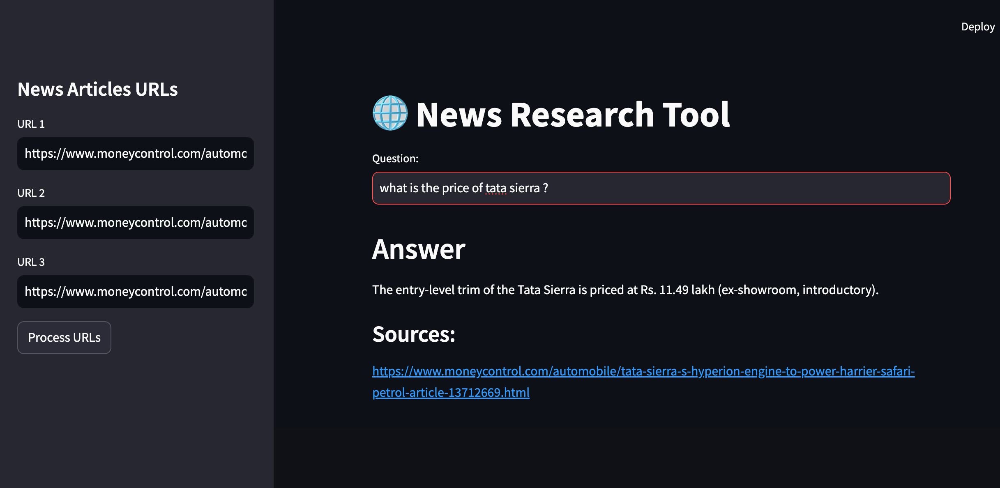
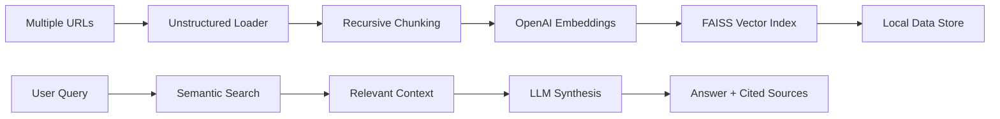

---

# 🌐 News Research Tool

**NewsTrace** is a high-performance RAG (Retrieval-Augmented Generation) application designed for multi-domain research. Whether you are tracking **AI developments**, **Medical research**, **Global politics**, or **Market trends**, this tool extracts precise insights from any web-based news source.



## 🚀 Versatile Use Cases

* **Tech & Innovation:** Track product launches, software updates, and emerging tech across various blogs.
* **Healthcare & Science:** Analyze medical journals, FDA approvals, or breakthrough research papers.
* **Sports Analytics:** Aggregate player stats, injury reports, and match analysis from diverse sports news outlets.
* **Legal & Policy:** Research new regulations, court rulings, and legislative changes across different jurisdictions.

## 🧠 Efficiency & Cost Optimization

### 1. Contextual Data Chunking

Raw web content is often cluttered with "noise."

* **Clean Extraction:** We use the `UnstructuredURLLoader` to strip away ads and HTML, focusing only on the narrative text.
* **Recursive Splitting:** The `RecursiveCharacterTextSplitter` ensures that complex topics—like medical research or legal codes—are broken down without losing their logical structure.

### 2. Semantic Filtering (The Cost-Saver)

Traditional search looks for keywords. **NewsTrace** looks for **meaning**.

* **Vector Embeddings:** Your articles are converted into a mathematical space where "Electric Vehicles" and "Clean Energy Transport" are neighbors, even if they share no common words.
* **The FAISS Filter:** Instead of feeding 50 full articles to the LLM (which is slow and expensive), we use **FAISS** to pinpoint the exact 3-4 paragraphs that answer your question.
* **Cost Efficiency:** You only pay for the **relevant 5%** of the data, reducing your OpenAI token costs by **up to 95%** compared to standard chat interfaces.

## 🛠️ Technical Workflow



## 📈 Performance vs. General AI

| Feature | Standard ChatGPT | **Universal News Research Tool** |
| --- | --- | --- |
| **Data Scope** | Fixed (Training Data) | **Dynamic (Any URL you provide)** |
| **Precision** | General Summaries | **Deep-Dive Fact Retrieval** |
| **Cost** | High (for long docs) | **Optimized (Small context window)** |
| **Verification** | "Trust me" | **Direct Source Attribution** |

## 📁 Installation & Setup

1. **Clone & Install:**
```bash
git clone https://github.com/your-username/news-research-tool.git
pip install -r requirements.txt

```


2. **Environment:** Add your `OPENAI_API_KEY` to a `.env` file.
3. **Launch:**
   ```bash
   streamlit run main.py
    ```
